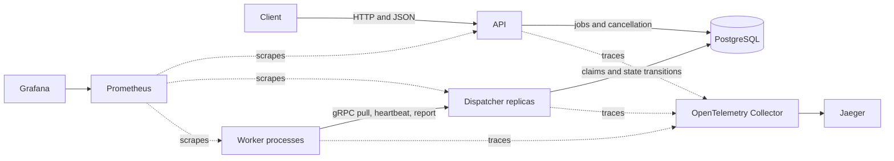

# Quarry architecture

Quarry separates client control, durable coordination, and job execution. PostgreSQL holds all authoritative state. The API and dispatcher can restart without losing jobs, attempts, leases, retry schedules, cancellation requests, or worker records.

## System shape

Workers never connect to PostgreSQL. They receive only the job type, payload, attempt identity, timeout, and trace context needed to execute one attempt.

## Component ownership

| Component | Owns | Does not own |
| --- | --- | --- |
| API | Submission, job reads, attempt-history reads, cancellation requests, HTTP health, and API metrics | Execution, scheduling, claims, and retries |
| Dispatcher | Worker registration, capacity-aware claims, leases, heartbeats, completion reports, retries, expired-lease recovery, and gRPC health | Durable in-memory state and handler execution |
| Worker | Registered handlers, bounded local concurrency, execution contexts, timeout signals, panic recovery, heartbeats, and graceful drain | PostgreSQL access, scheduling policy, and workflow coordination |
| PostgreSQL | Jobs, attempts, workers, leases, retry eligibility, cancellation state, idempotency records, and transition timestamps | Handler execution |
| Observability services | Metrics storage and display, trace transport and display, and diagnostic views | Application decisions or authoritative job state |

The dispatcher is stateless between requests. Multiple dispatcher replicas coordinate through PostgreSQL transactions rather than through peer communication or leader election.

## Durable model

A job is the logical unit submitted by a client. An attempt records one worker's execution of that job. The separation preserves history and lets Quarry retry a job without overwriting the failed or abandoned attempt.

Job states are `queued`, `running`, `retry_wait`, `succeeded`, `dead_lettered`, and `cancelled`. Attempt states are `running`, `succeeded`, `retryable_failed`, `permanent_failed`, `cancelled`, `timed_out`, `panicked`, and `abandoned`.

PostgreSQL stores `available_at` for durable retry scheduling. A retry becomes eligible when database time reaches that value. PostgreSQL also supplies lease and transition time, so workers do not decide whether their own leases remain valid.

## Submission and control flow

1. A client sends `POST /v1/jobs` with a job type, a JSON payload, a positive timeout, and an optional maximum-attempt count.
2. The API validates the request and inserts a `queued` job in PostgreSQL.
3. If the client supplies `Idempotency-Key`, the API hashes the normalized submission. A matching replay returns the original job; conflicting input returns HTTP 409.
4. The client reads current state through `GET /v1/jobs/{id}` and attempt history through `GET /v1/jobs/{id}/attempts`.
5. A cancellation request finishes a queued or retry-wait job immediately. For a running job, the API records a cancellation request for the worker to observe through its next heartbeat.

The API does not call a worker or place work in an in-memory queue. Committing the PostgreSQL row makes the job available to any compatible worker.

## Claim and execution flow

1. A worker creates a new process identity and registers its hostname, version, and concurrency. Each acquisition request includes its supported job types.
2. The worker asks for no more jobs than its free executor count.
3. The dispatcher locks the worker record and calculates claim capacity from registered concurrency and current running jobs.
4. One transaction selects eligible jobs with `FOR UPDATE SKIP LOCKED`, changes them to `running`, assigns the worker and lease, and inserts one attempt row per claim.
5. The worker runs each acquired attempt in one of its fixed executor goroutines. A handler receives a context with the submitted timeout.
6. The heartbeat loop renews leases for active attempt identities and carries cancellation requests back to their handler contexts.
7. The worker reports a typed outcome. The dispatcher locks the job and attempt, checks the worker ID, attempt number, current job state, and unexpired lease, then commits the attempt and job transitions together.
8. The worker retains the local capacity slot until the completion report is acknowledged or rejected as stale.

Workers use transient retry backoff for acquisition and completion-report RPC failures. A repeated completion report is accepted only when it matches the stored terminal result. A conflicting or stale report fails.

## Retry and recovery flow

Retryable handler failures, timeouts, panics, and expired leases can move a job to `retry_wait`. Quarry calculates exponential backoff with full jitter and stores the next `available_at` time. If the attempt count reaches `max_attempts`, the job becomes `dead_lettered` instead.

The dispatcher reaper scans expired running jobs in bounded batches. It locks rows with `FOR UPDATE SKIP LOCKED`, clears ownership and the lease, and records the attempt. An ordinary expired attempt becomes `abandoned` with `lease_expired`, then the job enters retry wait or becomes dead-lettered. An expired attempt with a pending cancellation request becomes `cancelled` instead.

Attempt identity fences the old worker. A report can change state only when its worker ID and attempt number still match the current running job and its lease has not expired. Late success from the old attempt cannot overwrite the replacement attempt.

Acknowledgement loss remains different from duplicate state mutation. If a worker completes an external side effect and exits before Quarry records success, the lease expires and another worker executes the job again. Quarry preserves both attempts, but it cannot deduplicate an external side effect that lies outside its database transaction.

## Cancellation and shutdown

Cancellation and execution timeout use Go contexts. The long-running `demo.sleep` handler observes its context, but Quarry cannot force a custom handler to return.

On SIGTERM, a worker stops acquiring jobs and keeps heartbeating active attempts while it drains. If the configured shutdown deadline expires, the worker cancels local contexts and exits. Any attempt without an accepted completion report remains recoverable through its lease.

## Observability flow

Each process writes structured JSON logs. Job and worker identifiers connect logs with API state.

Prometheus scrapes API, dispatcher, and worker metrics. The dispatcher also exports PostgreSQL-backed queue depth, oldest eligible-job age, active-job count, and active-worker count. Grafana provisions the `quarry-overview` dashboard from the repository.

The API stores W3C trace context with the job. The dispatcher continues that trace for the claim, the worker continues it for execution and handler work, and the dispatcher records completion. OTLP export goes through the Collector to Jaeger. Telemetry failures do not become job state.

## Deployment topologies

| Capability | Docker Compose | kind |
| --- | --- | --- |
| Purpose | Complete local product and observability demonstration | Local Kubernetes packaging and scaling proof |
| PostgreSQL | One container with a named volume | One StatefulSet and persistent-volume claim |
| Migrations | One dependency-ordered service | One Job applied after PostgreSQL readiness |
| Applications | API, dispatcher, and scalable workers | 1 API replica, 2 dispatcher replicas, and 3 worker replicas by default |
| Health | The validation path checks API readiness and ordered dependencies | HTTP API probes and native gRPC dispatcher probes |
| Resources | Local Docker allocation | Explicit requests and limits on every workload |
| Observability | Prometheus, Grafana, Collector, and Jaeger | Application metrics and traces are not deployed in the kind demonstration |

All four Quarry images use pinned multi-stage builds and non-root distroless runtime targets. The kind worker has a Kubernetes termination grace period longer than the worker's own shutdown deadline.

The local PostgreSQL deployments are single instances. They demonstrate packaging and persistence, not high availability, backup, failover, or production operations.

## V1 boundary

Quarry is a distributed job execution system, not a workflow engine. It has no DAG scheduler, broker, leader election, arbitrary user-code runtime, automatic scaling, or cloud infrastructure. A future workflow coordinator can make an ordinary job eligible without changing worker execution, but V1 contains no workflow-specific types or behavior.

Read [guarantees and limits](guarantees.md) for the exact behavior boundaries and [benchmark evidence](benchmarks.md) for measured performance.
